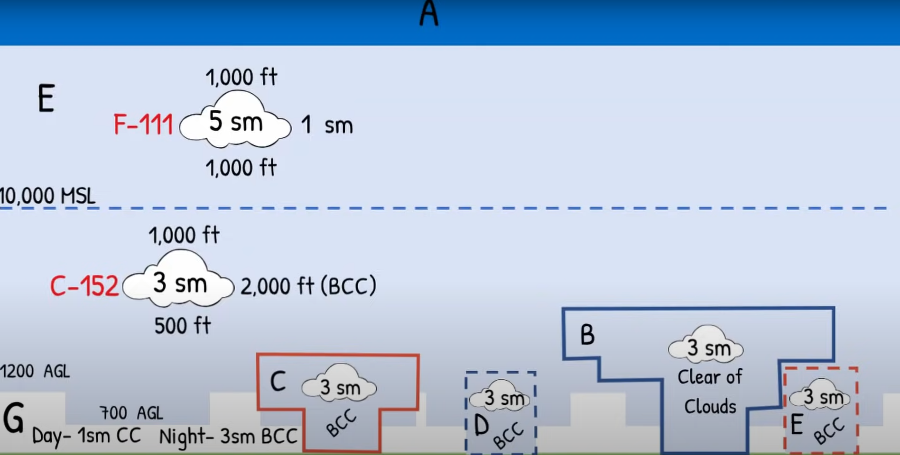
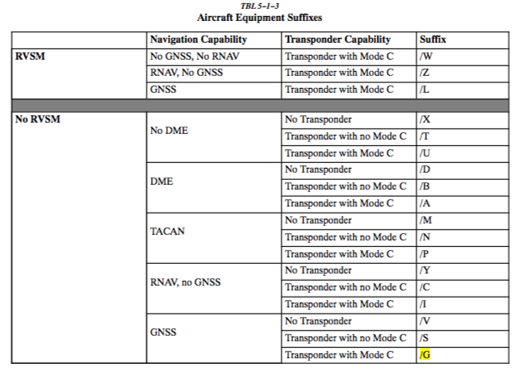
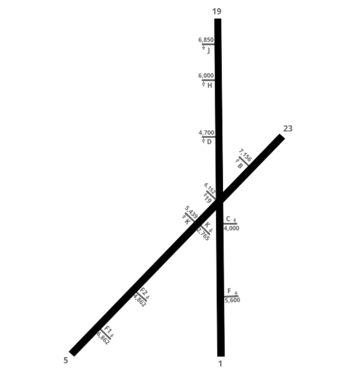

# **ZOB Training Cheat Sheet**

***Author:*** Nick Saker
  
***Created:*** January 7th, 2024

# Quick Notes
## LVZ (Wilkes Barre VOR)

# Airspaces

# Equipments

# Cleveland VOR's
Ident|Name|Facility
-|-|-
MBS|Saginaw|VORDME
DXO|Detroit|VORDME
CRL|Carleton|VORDME
DJB|Dryer|VORDME
CXR|Chardon|VORDME
ACO|Akron|VORDME
BSV|Briggs|VORDME
AIR|Bellaire|VORDME
HLG|Wheeling|VORDME
JHW|Jamestown|VORDME
MGW|Morgantown|VORDME
JST|Johnstown|VORDME
ROC|Rochester|VORDME
GEE|Genesso|VORDME
FNT|Flint|VORTAC
FDC|Flag City|VORTAC
MFD|Mansfield|VORTAC
YNG|Youngstown|VORTAC
ETG|Keating|VORTAC
JXN|Jacson|DME
JFN|Jefferson|DME
CIP|Clarion|DME
REC|Revloc|DME
BUF|Buffalo|DME
BUD|Buckeye|VOR

# Arrival Reference
## KBDR - Bridgeport
Restrictions|Altitude Restrictions|Route
-|-|-
JETS NORTH OF J190|FL290|RKA BDR1
JETS ENTERING MIP SECTOR|FL350|RKA BDR1
JETS ENTERING PSB OR SEG SECTOR|FL350|RKA BDR1

## KJYO - Leesburg
Restrictions|Altitude Restrictions|Route
-|-|-
RNAV JETS|FL270|MGW GIBBZ4
PROPS|17000|MRB AML
NON-RNAV JETS|FL250|ESL ESL187 FINKS DOCCS3

## KDCA - Ronald Reagan Washington Natl
Restrictions|Altitude Restrictions|Route
-|-|-
RNAV JETS|FL310|BUCKO FRDMM5
RNAV PROPS|FL210|ESL TIKEE4
NON-RNAV JETS|FL310|BUCKO NUMMY3
NON-RNAV PROPS|FL210|ESL V377 TTUMS V128 CSN
THROUGH ZNY|FL250|PSB SKILS5

## KORD - Chicago Ohare Intl
Restrictions|Altitude Restrictions|Route
-|-|-
RNAV, D21 TERMINAL|FL280|KAYLN# SMUUV WYNDE2
FROM CLE TERMINAL|ANY ALTITUDE|WATSN4
RNAV, DEPARTING TOL TERMINAL|FL220|WATSN4
RNAV, MUST ENTER ZAU VIA ECK SECTOR|FL320|WYNDE2
RNAV, MUST ENTER ZAU SOUTH OF GIJ SECTOR|FL340|WATSN4
NON-RNAV, D21 TERMINAL|FL220|JXN AZO ELX V100 DEERE
NON-RNAV, MUST ENTER ZAU VIA ECK SECTOR|FL320|VIO ELX V100 DEERE
NON-RNAV, MUST ENTER ZAU SOUTH OF GIJ SECTOR|FL340|OXI OXI
NON-RNAV, DEPARTING TOL TERMINAL|FL220|OXI OXI#

## KBWI - Baltimore / Washington Intl
Restrictions|Altitude Restrictions|Route
-|-|-
RNAV JETS|FL290|NUSMM/KEMAN/LUNDY ANTHM3
PROPS|17000|MRB
NON-RNAV JETS|FL250|AIR EMI7
THROUGH ZNY|FL250|IZZEE TRISH3

## KTEB - Teterboro
Restrictions|Altitude Restrictions|Route
-|-|-
JETS|FL350|J70 LVZ LVZ4
JETS FROM PIT OR EAST OF PIT|FL350|PSB MAGIO LVZ LVZ4
PROPS SOUTH OF SLT OR UNABLE LVZ4|FL230|PENNS STW
PROPS|FL270|J70 LVZ LVZ4
THROUGH ZBW|FL270|WEARD V489 COATE

## KCVG - Cincinnati Northern Kentucky Intl
Restrictions|Altitude Restrictions|Route
-|-|-
DEPARTING D21/TOL TERMINAL|FL200|TORRR DEBAR ARBAS RID MEEKR
RNAV, DEPARTING CLE TERMINAL|FL220|APE TIGRR3
NON-RNAV, DEPARTING CLE TERMINAL|FL220|APE CINCE9
RNAV|FL340|CTW TIGRR3
RNAV|FL320|APE TIGRR3
NON-RNAV|FL340|CTW CINCE9
NON-RNAV|FL320|APE CINCE9
THROUGH ZAU|ANY ALTITUDE|FWA ZEKUS ARBAS RID MEEKR

## KFRG - Farmingdale
Restrictions|Altitude Restrictions|Route
-|-|-
JETS AND PROPS ELIGIBLE LENDY8|ANY ALTITUDE|HOXIE J70 LVZ LENDY8
PROPS|17000|PSB V6 FJC ARD V276 ZIGGI
EAST OF PIT|ANY ALTITUDE|PSB MAGIO LVZ LENDY8

## KMDW - Chicago Mindway Intl
Restrictions|Altitude Restrictions|Route
-|-|-
RNAV, NORTH OF V233|FL220|ZEGBI LEROY BAGEL PANGG5
RNAV, V233 OR SOUTH, AND NORTH OF J60|FL220|BAGEL PANGG5
RNAV, J60 OR SOUTH|FL300|BAGEL PANGG5
NON-RNAV, NORTH OF V233|FL220|AZO GSH GSH9
NON-RNAV, V233 OR SOUTH, AND NORTH OF J60|FL220|GSH GSH9
NON-RNAV, J60 OR SOUTH|FL300|GSH GSH9

## KIAD - Washington Dulles Intl
Restrictions|Altitude Restrictions|Route
-|-|-
RNAV JETS|FL270|MGW GIBBZ4
PROPS|17000|MRB AML
NON-RNAV JETS|FL250|ESL ESL187 FINKS DOCCS3
JETS NORTH OF GEE SECTOR'S SOUTHERN BOUNDARY, THROUGH ZNY|FL300|J59 PSB PRIVO3 (OR) J59 PSB MAPEL3
JETS THROUGH ZNY|FL250|PSB PRIVO3 (OR) PSB MAPEL3
PROPS THROUGH ZNY|17000|SEG LEGGO6 (OR) SEG SEG6

## KOXC - Waterbury-Oxford
Restrictions|Altitude Restrictions|Route
-|-|-
JETS NORTH OF J190|FL290|RKA BDR1
JETS ENTERING MIP SECTOR|FL350|RKA BDR1
JETS ENTERING PSB OR SEG SECTOR|FL390|RKA BDR1

## KISP - Long Islan Mac Arthur
Restrictions|Altitude Restrictions|Route
-|-|-
NONE|ANY ALTITUDE|NELIE3

# Akron  ATCT
Callsign | Position | Radio Name | ID | Frequency
-|-|-|-|-
CAK_DEL | Delivery | Akron Canton Delivery | CD | 132.050
CAK_GND | Ground | Akron Canton Ground | GC | 121.700
CAK_TWR | Local | Akron Canton Tower | LC | 134.750

## Clearances
- Maintain 3000 and to expect requested altitude 10 minutes after departure.
- VFR Aicraft will be issued requested altitude except:
1) Requests at or below 3000 will be issued:  
“Maintain at or below 3000”.
2) Requests higher than 3000 will be issued:  
“Maintain 3000, expect higher with departure”

## Ground Control
### General
- GC is responsible for all movement areas on the airport except the runways, the
northwest helipad, and the portion of the National Guard Taxiway designated as
a movement area.
- GC may be authorized to assume the responsibilities of the non-advertised
inactive runway by Local (this is a required item in the pre-position controller
briefing)
- GC will use the intersection departure distances in FIG. 4-1 for any aircraft that
requests/or is willing to perform an intersection departure and shall be advised
prior to taxi. 
### Taxiway Routes and Restrictions
- GC must protect the intersection of taxiways C and E for all aircraft that may use
these movement areas to exit active runways.
- GC may issue multiple runway crossing clearances in a single clearance for
aircraft operating on Taxiway Kilo.

# Buffalo ATCT / TRACON
Callsign | Position | ID | Frequency
-|-|-|-
BUF_DEL | Delivery | CD | 124.700
BUF_GND | Ground | GC | 133.200
BUF_TWR | Local | T | 120.500
BUF_E_APP | East Radar | E | 126.150
BUF_W_APP | West Radar | W | 126.500
BUF_F_APP | Final Radar | F | 123.800
ERI_APP | Erie Radar | X | 121.000

## Position Combination
TRACON positions should be opened and combined:
1) BUF_E_APP
    - E/W combined. May use simplified BUF_APP callsign
    - X may be combined when the position is not separately staffed by
another controller IAW 6.6.
2) ERI_APP
    - Other positions may only be opened during events or with the permission of the
ATM/DATM/TA/EC/CIC.

## Issue Clearances / Amendments / Instructions
CD shall issue ATC clearances to IFR and VFR Class C departures as followed:
- IFR Departures: Assign 10,000ft or requested altitude if lower, and inform the
aircraft to expect (requested altitude) 10 minutes after departure.
- VFR Class C Departures: Determine destination/direction of flight and make
note of requested altitude in flight strip. No initial altitude restrictions necessary
unless otherwise coordinated.
- Using RWY05/RWY23/RWY32: Traffic departing westbound or through DKK
DME shall be assigned to WR.
- Using RWY14: Traffic departing westbound or through DKK DME shall be
assigned to ER.
- RV to first fix

# Cleveland ATCT / TRACON
Callsign | Position | ID | Frequency
-|-|-|-
CLE_DEL | Delivery | CD | 125.050
CLE_GND | Ground | GC | 121.700
CLE_TWR | Local | L | 124.500
CLE_A_APP | Feeder | A | 124.000
CLE_F_APP | Final | F | 119.625
CLE_D_APP | North Departure | D | 128.250
CLE_R_APP | South Departure | R | 135.875
CLE_N_APP | North Satellite | N | 125.350
CLE_E_APP | East Satellite | E | 125.500
CLE_S_APP | South Satellite | S | 118.600
MFD_APP | West Satellite | W | 124.200

## Position Combination
TRACON positions should be opened and combined:
1. CLE_A_APP
- A/F/D/R/N combined. May use simplified CLE_APP callsign
- Solo certified controllers may connect as CLE_S_APP on 124.000.
- E/S/W may be combined when the positions are not separately staffed by
another controller.
2. CAK_E_APP
- E/S combined. May use simplified CAK_APP callsign.
- W may be combined with E/S when the position is not separated staffed
by another controller.
3. MFD_APP

Other positions may only be opened during events or with the permission of the
ATM/DATM/TA/EC/CIC.

## Issue Clearances / Amendments / Instruction / SIDS

CD shall issue ATC clearances to IFR and VFR Class B departures as followed:
1. IFR Departures: Standard Instrument Departure Route (SID) should be utilized
if the aircraft is capable. Aircraft who receive a SID must be issued “Climb via
SID”. If the aircraft is not filed on a SID, they shall be:
- Jet: cleared to maintain 6,000ft.
- Turboprop/Piston: cleared to maintain 4,000ft.

2. GTLKE SID usage:
- DAIFE transition for use for ORD departures only.
- BAGEL transition for use for MDW departures only.
- ALPHE/YABRO transition for use for any departure.

3. Local IFR: aircraft requesting a “local” IFR (destination airports within the CLE
terminal area) clearance shall be issued 4,000 feet and radar vectors to
destination airport.

4. VFR Class B Departures: determine destination/direction of flight, clear
aircraft “out” of CLE Class B, and maintain VFR at or below the following
altitudes:
If on-course heading is: Clear the aircraft at or below:
252 degrees clockwise to 058 degrees 2,500 feet
059 degrees clockwise to 251 degrees 3,000 feet

5. Departure Frequency Designation:
- Aircraft cleared via GTLKE#, PFLYD#, ZAAPA# and Non-SID departures shall
be assigned DN (D) as their departure frequency.
- Aircraft cleared via CAVVS# and KKIDS# shall be assigned DS (R) as their
departure frequency.

## SIDS
Direction | Name
-|-
South | CAVVS4
West | GTLKE4
South East | KKIDS1
North East | PFLYD1
South West | ZAAPA5
