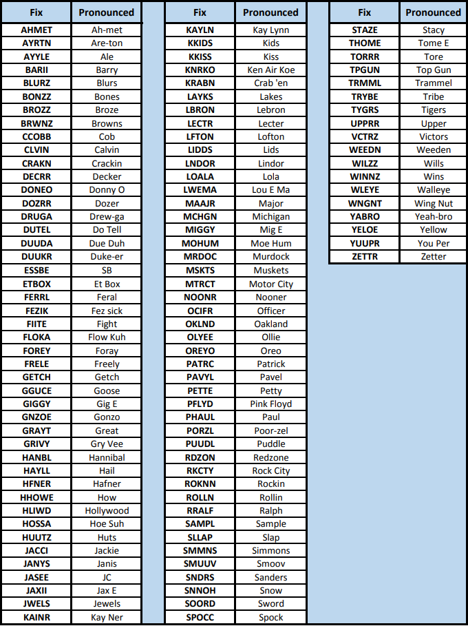
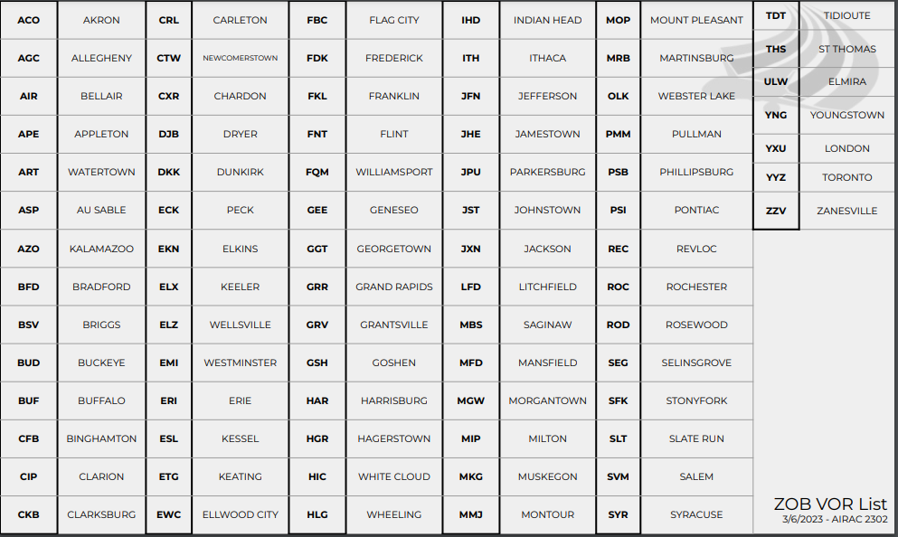

# **ZOB Training Cheat Sheet**
  
***Created:*** January 7th, 2024

# Quick Notes
- EXCEPT CHANGE ROUTE TO READ AFTER (FIX) JOIN (STAR)
- **LVZ** (Wilkes Barre VOR)
- **BR** Mist
- **GR** Hail
- [Weather Matrix](http://www.moratech.com/aviation/metar-class/metar-pg9-ww.html#:~:text=Mist%20shall%20be%20coded%20as,shall%20be%20coded%20as%20HZ.)
- Ceiling is lowest broken or overcast

# Fixes

# VOR's

# Airspace Diagram

# Equipment Code Suffixes

# SIDS
- Radar Vector
- Pilot Nav
- Hybrid Nav

# [Airline Codes](https://en.wikipedia.org/wiki/List_of_airline_codes)
ICAO|Callsign
-|-
AAL|American
UAL|United
AWE|Cactus
COA|Continental
RPA|Brickyard
NKS|Spirit Wings
DAL|Delta
TPC|Pilot Club
WAT|Walker
GJS|Lindburgh
DCM|Dot Com
JIA|Blue Streak
ASH|Air Shuttle
EDV|Endeavour

# VFR Quick Ref
## Class B
### Flight Following
- Clearance, Altitude, Frequency, Transponder
#### Example:
- **STATION**, **AIRCRAFT**, requesting VFR clearance to the west, at 2500.
- **AIRCRAFT**, **STATION**, cleared out of Bravo airspace, maintain VFR at or below **ALTITUDE**, expect higher with departure, departure frequency **DEP FREQ**, squawk **BEACON**
### Without Flight Following
- Clearance, Altitude, Transponder
#### Example:
- **STATION**, **AIRCRAFT**, requesting VFR clearance to the west, at 2500.
- **AIRCRAFT**, **STATION**, cleared out of Bravo airspace, maintain VFR at or below **ALTITUDE**, squawk **BEACON**
### Traffic Pattern:
- Clearance, Altitude, Transponder
#### Example:
- **STATION**, **AIRCRAFT**, requesting VFR clearance for traffic work.
- **AIRCRAFT**, **STATION**, cleared to enter **AIRPORT** Bravo airspace, maintain VFR, squawk **BEACON**

## Class C
### Flight Following
- Altitude, Frequency, Transponder
#### Example:
- **STATION**, **AIRCRAFT**, requesting VFR clearance to the west, at 6500.
- **AIRCRAFT**, **STATION**, maintain VFR at or below **ALTITUDE**, departure frequency **DEP FREQ**, squawk **BEACON**
### Without Flight Following
- Altitude, Transponder
#### Example:
- **STATION**, **AIRCRAFT**, requesting VFR clearance to the west, at 6500.
- **AIRCRAFT**, **STATION**, maintain VFR at or below **ALTITUDE**, squawk **BEACON**
### Traffic Pattern
- Altitude, Transponder
- **STATION**, **AIRCRAFT**, requesting VFR clearance for traffic work.
- **AIRCRAFT**, **STATION**, maintain VFR, squawk **BEACON**

## Class D
### Flight Following
- Altitude, Frequency, Transponder
- **STATION**, **AIRCRAFT**, requesting VFR clearance to the north, at 4500.
- **AIRCRAFT**, **STATION**, maintain VFR at or below **ALTITUDE**, departure frequency **DEP FREQ**, squawk **BEACON**.
### Without Flight Following
- Altitude
- **STATION**, **AIRCRAFT**, requesting VFR clearance to the north.
- **AIRCRAFT**, **STATION**, maintain VFR at or below **ALTITUDE**, call for taxi.

# IFR CRAFT
## Clearance Limit
- Cleared to (limit) airport
- Cleared to (NAVAID?fix/waypoint/intersection)
- Ex: Cleared to Dulles airport

### Routing No-SID
- Cleared to pittsburgh airport, radar vectors akron, then as filed.
- Cleared to pittsburgh airport, then as filed.

### Routing Hybrid
- AAL1234, cleared to Dulles airport, pittsburgh 5 departure, radar vectors morgantown, then as filed.
- AAL1234, cleare to Dulles airport, pittsburgh 5 departure, then as filed.

### Routing Pilot-Nav
- JIA1234, cleared to Charlotte Airport, CAVVS4 departure, appleton transition, then as filed.

### Routing End Pilot Nav
- eja554, cleared to baltimore airport, ahmet4 departure, ellwood city transition, then as filed.

### Routing End Radar Vectors
- jbu234 cleare dto detroit airport, skorr4 departure, ynkee transition, radar vectors gayel, then as filed.

### Obstacle Departure Prodcedure
- (callsign), cleared to (clearance limit), departure via the (airport)(runway number) departure procedure
- (callsign), cleared to (clearance limit), departure via the (procedure name) obstacle departure procedure
- Ex: eja203, cleared to rochester airport, depart via the Burke Lakefront, runway 24r departure procedure

## Altitude
### Maintain
- "maintain" when radar vectors, radar vector segment, no published crossing restrictions, radar vector segment prior to pilot nav with published crossing, or local procedure.
- Ex: n56ep, cleared to erie airport, radar vectors Chardon, then as filed, maintain 4000
- Ex: aal1326, cleared to lagaurdia airport, pittsburgh5 departure, then as filed, maintain 5000

### Climb via SID
- contains published crossing restrictions and top altitude.
- Ex: edv5076, cleared to lexington airport, barii2 departure, sinkr transition, then as filed. climb via sid.

### Climb via SID Except Maintain
- cintains published crossing but filed below top altitude, top altitude designated by atc or local procedure.
- Ex: lxj402, cleared to cleveland airport, lidds2 departure, then as filed. climb via sid, except maintain 7000.

## Cruise/Filed Altitude
- alt correct for dir of flight, any additional restrictions per local proc or LOA, expect final alt given in duration or distance
- Ex: dal1148, cleared to atlanta airport, barii2 departure, sinkr4 transition, then as filed. climb via sid, expect fl 4000 10 min after departure.

## Departure Freq
- radar controllers working above (vatsim top-down) 
- Ex: n56ep, cleared to rochester airport, as filed. maintain 6000, exp 13000 10 minutes after departure, departure freq 128.25

## Squawk Code
- discrete code assigned to all aircraft for ifr, designated at the end of craft.
- Ex: n830lw, cleared to erie ottowa airport, radar vectors keatn, then as filed. maintain 4000, exp 8000 10 min after departure. departure frequency 118.6, squawk 6013.

# VFR

## Class D
Without Flight Following:
- do not require any additional instruction, taxi to appropriate dep runway, since no radar services once departed airspace

With Flight Following:
- necesary to issue (A)ltitude, (F)requency, and as necessary a possible (T)ransponder Code.

Example:
- n68df, maintain vfr at or below 3000, departure frequency 119.35

VFR Traffic Pattern:
- whilst remainaing in the class d issuance of altitude, frequency, or transponder is not required (unless SOP), taxi to runway as necessary.

## Class C
Without Flight Following + Below:
- Unless SOP, FVR w/o ff with intentions to remain below class c, require approprtiate altitude to remain outside class c, and a transponder code (unless SOP)

With Flight Following + In
- Necessary to issue altutides, departure freq, and transponder.

Example:
- n56ep, maintain vfr at or below 2500, departure frequency 126.15, squawk 4142

VFR Traffic Pattern:
- recommended or mandatory per SOP, issue a transponder code.

Example:
- n830lw, maintain vfr squawk 5423

## Class B
- must be issues a clearance out of the airspace. Per the SOP, altitude, frequency, and transponder will be issues regardless of flight following.

Example:
- n553ma, cleared out of thr bravo airspace, maintain vfr at or below 2500, departure frequency 128.25, squawk 4352

VFR Traffic Pattern:
- remaining inside the class b shall be issued clearance to enter the bravo, in addition to transponder.
 
Example:
- n135jm, cleared to enter the bravo airspace, maintain vfr, squwk 6425

## R in Craft
- SOP may indicate a heading assigned to all vfr, we use "fly heading"

Example: n5844l, fly heading 330, maintain vfr at or below 3000, departure 118.3, squawk 5420.

- Additionaly, may be routed via published vfr dep procedure.

Example: n220er, cleared out of the bravo airspace via the west loch departure.

# Ground Control
## Taxi Clearance
*CALLSIGN*, runway *NUMBER*, taxi via *ROUTE* cross *RUNWAY* hold short *RUNWAY*

## Runway Crossing
*NUMBER* to cross runway *NUMBER* at *TAXIWAY*

## Intersection Departure
*CALLSIGN*, runway *NUMBER* at *TAXIWAY*, taxi via *ROUTE* cross *RUNWAY* hold short *RUNWAY*

# Arrival Reference
## KBDR - Bridgeport
Restrictions|Altitude Restrictions|Route
-|-|-
JETS NORTH OF J190|FL290|RKA BDR1
JETS ENTERING MIP SECTOR|FL350|RKA BDR1
JETS ENTERING PSB OR SEG SECTOR|FL350|RKA BDR1

## KJYO - Leesburg
Restrictions|Altitude Restrictions|Route
-|-|-
RNAV JETS|FL270|MGW GIBBZ4
PROPS|17000|MRB AML
NON-RNAV JETS|FL250|ESL ESL187 FINKS DOCCS3

## KDCA - Ronald Reagan Washington Natl
Restrictions|Altitude Restrictions|Route
-|-|-
RNAV JETS|FL310|BUCKO FRDMM5
RNAV PROPS|FL210|ESL TIKEE4
NON-RNAV JETS|FL310|BUCKO NUMMY3
NON-RNAV PROPS|FL210|ESL V377 TTUMS V128 CSN
THROUGH ZNY|FL250|PSB SKILS5

## KORD - Chicago Ohare Intl
Restrictions|Altitude Restrictions|Route
-|-|-
RNAV, D21 TERMINAL|FL280|KAYLN# SMUUV WYNDE2
FROM CLE TERMINAL|ANY ALTITUDE|WATSN4
RNAV, DEPARTING TOL TERMINAL|FL220|WATSN4
RNAV, MUST ENTER ZAU VIA ECK SECTOR|FL320|WYNDE2
RNAV, MUST ENTER ZAU SOUTH OF GIJ SECTOR|FL340|WATSN4
NON-RNAV, D21 TERMINAL|FL220|JXN AZO ELX V100 DEERE
NON-RNAV, MUST ENTER ZAU VIA ECK SECTOR|FL320|VIO ELX V100 DEERE
NON-RNAV, MUST ENTER ZAU SOUTH OF GIJ SECTOR|FL340|OXI OXI
NON-RNAV, DEPARTING TOL TERMINAL|FL220|OXI OXI#

## KBWI - Baltimore / Washington Intl
Restrictions|Altitude Restrictions|Route
-|-|-
RNAV JETS|FL290|NUSMM/KEMAN/LUNDY ANTHM3
PROPS|17000|MRB
NON-RNAV JETS|FL250|AIR EMI7
THROUGH ZNY|FL250|IZZEE TRISH3

## KTEB - Teterboro
Restrictions|Altitude Restrictions|Route
-|-|-
JETS|FL350|J70 LVZ LVZ4
JETS FROM PIT OR EAST OF PIT|FL350|PSB MAGIO LVZ LVZ4
PROPS SOUTH OF SLT OR UNABLE LVZ4|FL230|PENNS STW
PROPS|FL270|J70 LVZ LVZ4
THROUGH ZBW|FL270|WEARD V489 COATE

## KCVG - Cincinnati Northern Kentucky Intl
Restrictions|Altitude Restrictions|Route
-|-|-
DEPARTING D21/TOL TERMINAL|FL200|TORRR DEBAR ARBAS RID MEEKR
RNAV, DEPARTING CLE TERMINAL|FL220|APE TIGRR3
NON-RNAV, DEPARTING CLE TERMINAL|FL220|APE CINCE9
RNAV|FL340|CTW TIGRR3
RNAV|FL320|APE TIGRR3
NON-RNAV|FL340|CTW CINCE9
NON-RNAV|FL320|APE CINCE9
THROUGH ZAU|ANY ALTITUDE|FWA ZEKUS ARBAS RID MEEKR

## KFRG - Farmingdale
Restrictions|Altitude Restrictions|Route
-|-|-
JETS AND PROPS ELIGIBLE LENDY8|ANY ALTITUDE|HOXIE J70 LVZ LENDY8
PROPS|17000|PSB V6 FJC ARD V276 ZIGGI
EAST OF PIT|ANY ALTITUDE|PSB MAGIO LVZ LENDY8

## KMDW - Chicago Mindway Intl
Restrictions|Altitude Restrictions|Route
-|-|-
RNAV, NORTH OF V233|FL220|ZEGBI LEROY BAGEL PANGG5
RNAV, V233 OR SOUTH, AND NORTH OF J60|FL220|BAGEL PANGG5
RNAV, J60 OR SOUTH|FL300|BAGEL PANGG5
NON-RNAV, NORTH OF V233|FL220|AZO GSH GSH9
NON-RNAV, V233 OR SOUTH, AND NORTH OF J60|FL220|GSH GSH9
NON-RNAV, J60 OR SOUTH|FL300|GSH GSH9

## KIAD - Washington Dulles Intl
Restrictions|Altitude Restrictions|Route
-|-|-
RNAV JETS|FL270|MGW GIBBZ4
PROPS|17000|MRB AML
NON-RNAV JETS|FL250|ESL ESL187 FINKS DOCCS3
JETS NORTH OF GEE SECTOR'S SOUTHERN BOUNDARY, THROUGH ZNY|FL300|J59 PSB PRIVO3 (OR) J59 PSB MAPEL3
JETS THROUGH ZNY|FL250|PSB PRIVO3 (OR) PSB MAPEL3
PROPS THROUGH ZNY|17000|SEG LEGGO6 (OR) SEG SEG6

## KOXC - Waterbury-Oxford
Restrictions|Altitude Restrictions|Route
-|-|-
JETS NORTH OF J190|FL290|RKA BDR1
JETS ENTERING MIP SECTOR|FL350|RKA BDR1
JETS ENTERING PSB OR SEG SECTOR|FL390|RKA BDR1

## KISP - Long Islan Mac Arthur
Restrictions|Altitude Restrictions|Route
-|-|-
NONE|ANY ALTITUDE|NELIE3

# Akron  ATCT
Callsign | Position | Radio Name | ID | Frequency
-|-|-|-|-
CAK_DEL | Delivery | Akron Canton Delivery | CD | 132.050
CAK_GND | Ground | Akron Canton Ground | GC | 121.700
CAK_TWR | Local | Akron Canton Tower | LC | 134.750

## Clearances
- When approach airspace is split, CD will issue 118.6 for aircraft entering S sector
airspace and 125.5 for aircraft entering E sector airspace, as depicted in CLE
7110.65N
- Maintain 3000 and to expect requested altitude 10 minutes after departure.
- VFR Aicraft will be issued requested altitude except:
1) Requests at or below 3000 will be issued:  
“Maintain at or below 3000”.
2) Requests higher than 3000 will be issued:  
“Maintain 3000, expect higher with departure”

## Ground Control
### General
- GC is responsible for all movement areas on the airport except the runways, the
northwest helipad, and the portion of the National Guard Taxiway designated as
a movement area.
- GC may be authorized to assume the responsibilities of the non-advertised
inactive runway by Local (this is a required item in the pre-position controller
briefing)
- GC will use the intersection departure distances in FIG. 4-1 for any aircraft that
requests/or is willing to perform an intersection departure and shall be advised
prior to taxi. 
### Taxiway Routes and Restrictions
- GC must protect the intersection of taxiways C and E for all aircraft that may use
these movement areas to exit active runways.
- GC may issue multiple runway crossing clearances in a single clearance for
aircraft operating on Taxiway Kilo.

# Buffalo ATCT / TRACON
Callsign | Position | ID | Frequency
-|-|-|-
BUF_DEL | Delivery | CD | 124.700
BUF_GND | Ground | GC | 133.200
BUF_TWR | Local | T | 120.500
BUF_E_APP | East Radar | E | 126.150
BUF_W_APP | West Radar | W | 126.500
BUF_F_APP | Final Radar | F | 123.800
ERI_APP | Erie Radar | X | 121.000

## Position Combination
TRACON positions should be opened and combined:
1) BUF_E_APP
    - E/W combined. May use simplified BUF_APP callsign
    - X may be combined when the position is not separately staffed by
another controller IAW 6.6.
2) ERI_APP
    - Other positions may only be opened during events or with the permission of the
ATM/DATM/TA/EC/CIC.

## Issue Clearances / Amendments / Instructions
CD shall issue ATC clearances to IFR and VFR Class C departures as followed:
- IFR Departures: Assign 10,000ft or requested altitude if lower, and inform the
aircraft to expect (requested altitude) 10 minutes after departure.
- VFR Class C Departures: Determine destination/direction of flight and make
note of requested altitude in flight strip. No initial altitude restrictions necessary
unless otherwise coordinated.
- Using RWY05/RWY23/RWY32: Traffic departing westbound or through DKK
DME shall be assigned to WR.
- Using RWY14: Traffic departing westbound or through DKK DME shall be
assigned to ER.
- RV to first fix

# Cleveland ATCT / TRACON
Callsign | Position | ID | Frequency
-|-|-|-
CLE_DEL | Delivery | CD | 125.050
CLE_GND | Ground | GC | 121.700
CLE_TWR | Local | L | 124.500
CLE_A_APP | Feeder | A | 124.000
CLE_F_APP | Final | F | 119.625
CLE_D_APP | North Departure | D | 128.250
CLE_R_APP | South Departure | R | 135.875
CLE_N_APP | North Satellite | N | 125.350
CLE_E_APP | East Satellite | E | 125.500
CLE_S_APP | South Satellite | S | 118.600
MFD_APP | West Satellite | W | 124.200

## Position Combination
TRACON positions should be opened and combined:
1. CLE_A_APP
- A/F/D/R/N combined. May use simplified CLE_APP callsign
- Solo certified controllers may connect as CLE_S_APP on 124.000.
- E/S/W may be combined when the positions are not separately staffed by
another controller.
2. CAK_E_APP
- E/S combined. May use simplified CAK_APP callsign.
- W may be combined with E/S when the position is not separated staffed
by another controller.
3. MFD_APP

Other positions may only be opened during events or with the permission of the
ATM/DATM/TA/EC/CIC.

## Issue Clearances / Amendments / Instruction / SIDS

CD shall issue ATC clearances to IFR and VFR Class B departures as followed:
1. IFR Departures: Standard Instrument Departure Route (SID) should be utilized
if the aircraft is capable. Aircraft who receive a SID must be issued “Climb via
SID”. If the aircraft is not filed on a SID, they shall be:
- Jet: cleared to maintain 6,000ft.
- Turboprop/Piston: cleared to maintain 4,000ft.

2. GTLKE SID usage:
- DAIFE transition for use for ORD departures only.
- BAGEL transition for use for MDW departures only.
- ALPHE/YABRO transition for use for any departure.

3. Local IFR: aircraft requesting a “local” IFR (destination airports within the CLE
terminal area) clearance shall be issued 4,000 feet and radar vectors to
destination airport.

4. VFR Class B Departures: determine destination/direction of flight, clear
aircraft “out” of CLE Class B, and maintain VFR at or below the following
altitudes:
If on-course heading is: Clear the aircraft at or below:
252 degrees clockwise to 058 degrees 2,500 feet
059 degrees clockwise to 251 degrees 3,000 feet

5. Departure Frequency Designation:
- Aircraft cleared via GTLKE#, PFLYD#, ZAAPA# and Non-SID departures shall
be assigned DN (D) as their departure frequency.
- Aircraft cleared via CAVVS# and KKIDS# shall be assigned DS (R) as their
departure frequency.

## SIDS
Direction | Name
-|-
South | CAVVS4
West | GTLKE4
South East | KKIDS1
North East | PFLYD1
South West | ZAAPA5
